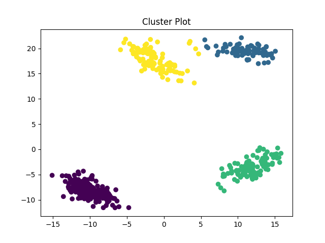
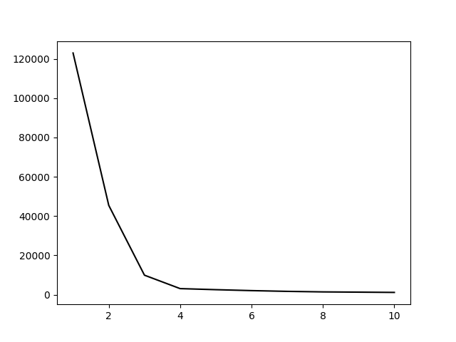
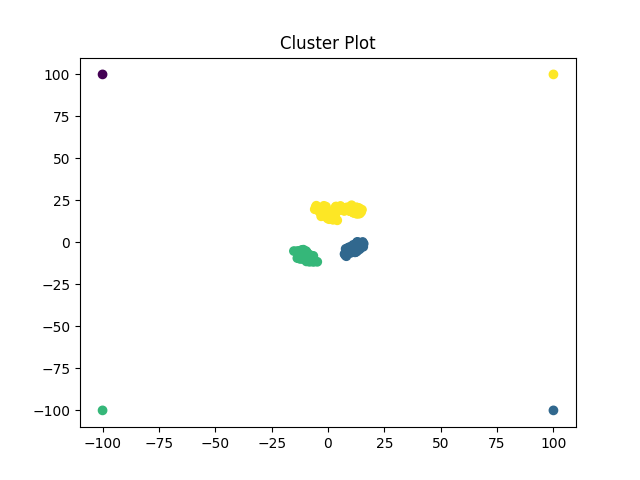
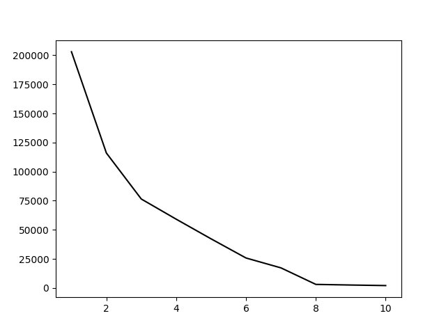
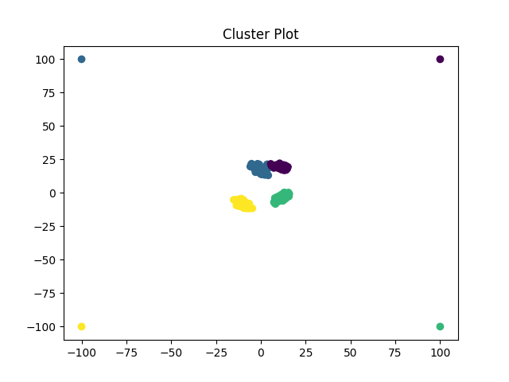
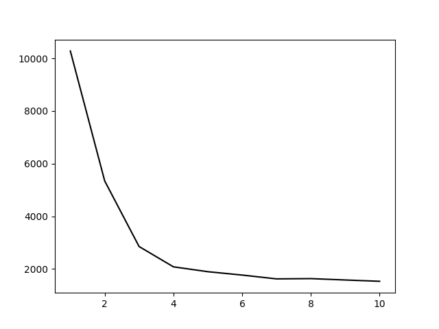
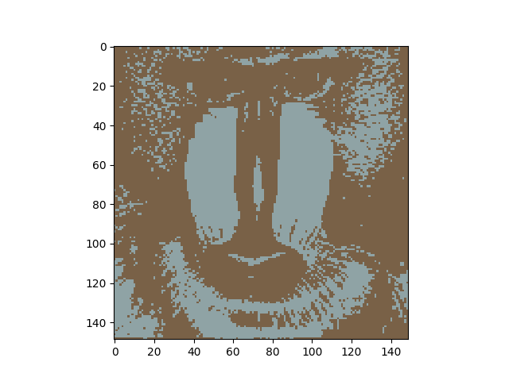
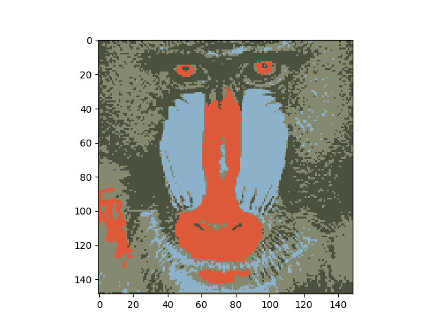
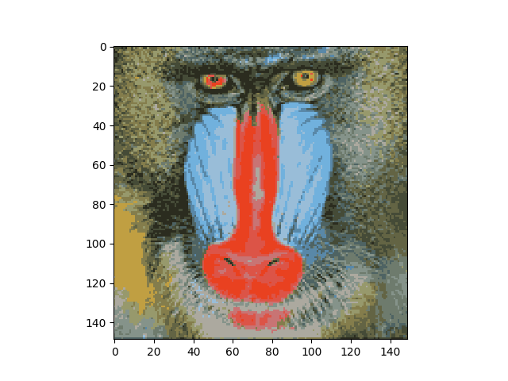

# l4l0b_o1j0b_a2

## 1.1)

a.   
p(y = 1) = 0.6  
   p(y = 0) = 0.4

b.   
p(x1 = 1 | y = 1) = 0.5  
p(x2 = 0 | y = 1) = 0.333333  
p(x1 = 1 | y = 0) = 1  
p(x2 = 0 | y = 0) = 0.75   

c. Naive bayes predicts y = 0  
   

## 1.2)

1. lunar
2. ['car' 'fact' 'gun' 'video'] 
3. talk.* 
  
 
## 1.3)

Random Forest (sklearn) validation error: 0.202  
Naive Bayes (ours) validation error: 0.188 (0.187 if Laplace smoothing is used)  
Naive Bayes (sklearn) validation error: 0.187  

Our Naive Bayes classifier performs quite well compared to Random Forest, 0.188 vs. 0.202, althought it should be noted that Random Forest's
validation error changes slightly each run due to its randomness. Our Naive Bayes gets a validation error of 0.188 compared to sklearn's Naive 
Bayes that gets 0.187. This 0.001 difference is likely due to sklearn including Laplace smoothing in their Naive Bayes classifier. In terms 
of runtime, the random forest and sklearn's Naive Bayes both run much quicker than our Naive Bayes.
See [naive_bayes.py](/code/naive_bayes.py).

## 1.4)

1. See [naive_bayes.py](naive_bayes.py) for the code
2. We need to modify the fit function. For conditional probability with Laplace smoothing, we add beta to the numerator and we add beta
   for each feature (word in this case) to the denominator. All of this is done in the fit function, so we don't need to change predict.
3. Scikit-learn's Bernoulli Naive Bayes, which is what we are using in this case, uses a beta value of 1. When we use a beta value of 1
   in our Naive Bayes, we get the same 0.187 validation error that sklearn gets.

## 1.5)

   O(t k d)  
   For each object in t, we must calculate the conditional probability that the object equals to each class label k. Each time we calculate the 
   conditional probability, we multiply together the d conditional probabilities for each feature. So for each class label k, we multiply the d
   conditional probabilities of the object, this gives us O(k d). We must do this for each object in t, so our over runtime is O(t k d). This is
   assuming that "Each feature can have up to c discrete values (you can assume c <= n)" means that there are c possible values for each feature,
   not that each feature could be a vector of length c.
   
## 2.1)

1. Our random tree is using bootstrapping, so its dataset is n objects randomly chosen from the original dataset with replacement. This means
   that some objects will appear multiple times and some objects will not appear in the dataset. Since we are not training on the full 
   dataset, we will not get a training error of 0 since some elements will be unseen to the tree when we are predicting the full
   dataset to calculate the training error. We are also not splitting on all of the features, so this will impact the accuracy of the tree.
2. see [random_forest.py](/code/random_forest.py)
3. Random forest info gain  
	  Training error: 0.000  
	  Testing error: 0.174  
   (Note that the testing error will change slightly with each run due to the random nature of the forest)

   Compared to a single decision tree, we get the same training error of 0, but much better test error (0.174 vs. 0.367). 
   Compared to a single random tree, we get better training error (0 vs. 0.155), and much better test error (0.174 vs. 0.534)
   In both cases our random forest performs much better. The random forest overfits less than the single decision tree and it is able
   to cover the entire dataset in general, unlike the single random tree. Although it does take longer to run than the singular trees.
4. Compared to scikit learn's random forest, our has a similar accuracy; however, it should be noted that the accuracy of each classifier
   varies by a few percent on each run due to their random nature. Here is the data from a sample run:  
   Our Random forest info gain  
      Training error: 0.000  
      Testing error: 0.182  
      Our random forest took: 17.126343s  
   sklearn's Random forest info gain, more trees  
      Training error: 0.000  
      Testing error: 0.155  
      Scikit's random forest took: 0.091292s  

   We can see from this data that our models have testing errors within a few percent of each other, but our model takes much longer to run. We've
   included plots of the testing error and runtime vs. number of trees. The testing error plot demonstrates the variability of the testing results
   due to randomness, but demonstrates that our forest is within a few percent of sklearn's.

     
   
    The runtime plot shows how much slower our forest is.  
   
		
## 2.2)

1. Fitting and Predicting increase in runtime as we increase the number of trees. We will have to create and fit more trees, and we would have to predict on more trees.
   
2.	Our tree is overfitting, what will help with overfittings  
   a. Since our tree is overfitting, this will not help  
   b. This could help since our tree is overfitting  
   c. Collecting more data could be helpful but since we are taking bootstrap samples of the same ratio (bootstrap sample size : dataset size), we could still overfit to our larger dataset which would not be benificial  
   d. This could help our model overfit less  
   e. This would cause our model to fit tighter to the training data and overfit more  
   f. This could help our model to overfit less
   
3. One easy way to do this would be to add transformed data during training. Creating new data by adding/removing delays before the audio, changing
   volume levels, or changing audio quality are a few ways that we could encourage invariance.

## 3.1)

1. [kmeans.py](code/kmeans.py#L45)

2. When plotting errors after every iteration of K-means, a trend emerged where for the most part, the error value only decreased marginally (<5%) every iteration of the algorithm. However, there was also occasionally a huge decrease from error values >10,000 to values <10,000.

3.  

4. The n_clusters hyperparameter dictates how many clusters to solve for.  
The init hyperparameter dictates how centers will be chosen: randomly, from a set list of centers, or through a smarter sklearn function "k-means++".  
The n_init hyperparameter dictates how many times the algorithm will be re-seeded and re-run.  
The max_iter hyperparameter dictates a ceiling on how many times k-means will re-iterate in a single run. It caps iterations if no stability is found.

## 3.2)

1. If the results of error are trusted to select a k, then there will be a tendency towards high k. As k increases, error will also decrease. By selecting k based on error, we would end up overfitting the model to the training data.

2. If test error is used instead of error, the problem will not be solved. The model will still be overfit, but to the test data instead of training data. This method would also contaminate the model, as it would use test data in a way that only training data should be used.

3.   
  

4. The biggest elbows in the figure seem to be at k=2, k=3, and k=4. The elbow at k=3 is the "largest" of the three and is likely the most suitable k value for the data.

## 3.3)

1.  
  
The result has 3 central clusters, grouped in a reasonable way. However, it also has 4 outlier points in the corners, 3 of which are assigned to the same clusters as the central points. It seems less than ideal to have obvious outliers grouped with the central clusters.

2.  
  
The largest elbow seems to be at k=8.

3.  
  
See [kmedians.py](code/kmedians.py).

4.  
  
The k-value that would be chosen here is 4, which seems to work well with how the plot for k=4 turned out.

## 3.4)
Note that for the purposes of this question, I will use "min_samples" (per sklearn's DBSCAN implementation) instead of minPts.

1. eps=2, min_samples=3

2. eps=4, min_samples=3

3. eps=4, min_samples=100

4. eps=20, min_samples=3

## 3.5)

1. No, standard k-means may converge to a sub-optimal solution. Random restarts or k-means++ could help with this 

2. A value of k = n will minimize the cost, but this would not be benificial since it would make each point a mean and cluster

3. K-means couldn't find the true clusters of a dataset with non-convex clusters, since it can only find convex clusters

4. This would impact the result of density based clustering since there may be no values for episilon that will find all the true clusters 

5. A key advantage is that humans are much better at classifying outliers, especially graphically. The drawback is that we cannot predict every
   possible kind of outlier, especially when dealing with many-featured data.

## 4)

1. Code is in [quantize_image.py](code/quantize_image.py)

2.  

3. At [b=1](figs/b_1_colours.png), we only see a gray-blue and brown, the core colors for the mandrill's fur.  
At [b=2](figs/b_2_colours.png), the "brown" is no longer present. A blue is still part of the palette, but the brown seems to have stratified into red and some grays.  
At [b=4](figs/b_4_colours.png), the palette seems to have gained serious diversity. Multiple browns, greys, blues, and reds are now apparent. A yellow has also appeared for some of the fur.  
At [b=6](figs/b_6_colours.png), the pallette has expanded in much the same way. The output compressed picture is almost indistinguishable from the original at low resolution.

