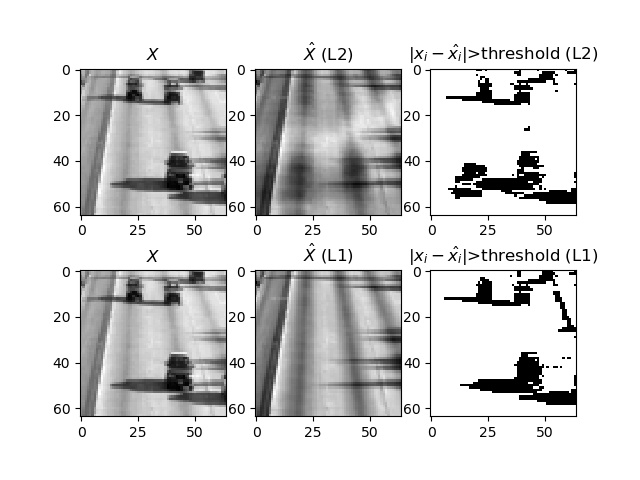

# l4l0b_a5

CPSC 340 a5 for l4l0b.

## 1
-----

### 1.1

### 1.2

### 1.3

### 1.4

## 2
-----
### 2.1

### 2.2
[code](code/main.py)  

### 2.3
[code](code/main.py)  

1) 0.30193815155  
2) k = 5

## 3
-----
### 3.1

[code](code/pca.py)  
I believe that I implemented RobustPCA incorrectly but will comment on its quality for the sake of argument. Despite the fact that the loss for my RobustPCA is huge (~3 million), it does a better job of identifying the cars and their shadows compared to AlternativePCA. When veiwing the images, RobustPCA has a more distinct car + shadow shape for values above the threshold compared to AlternativePCA.

## 4
-----
### 4.1
[code](code/manifold.py)  

### 4.2
PCA does an okay job at grouping the animals, such as placing the water animals near each other, but it still has problems such as placing giant panda near rabbit.
MDS organizes the animals in a mostly-logical way but it isnt perfect.
ISOMAP with nn=2 has some rather extreme grouping with quite distinct clusters. Large water animals form a cluster, Hippo and rhino form another cluster, larger land mammals form a cluster and the rest of the animals form the last cluster. This isnt perfect since the last cluster contains animals such as otter and beaver that are quite far from the water animal cluster.
ISOMAP with nn=3 gives the best results with the animals organized in the most logical way compared to the other methods.

## 5
-----
### 5.1
The kernel trick allows for the efficient use of a basis, that may be too large to store when explicitly transforming the features into a new space, since we don't need to compute the basis explicitly.

### 5.2
Using the kernel trick with svm's results in a better time complexity than kernel logistic regression O(n2 * k) vs O(n3) where k is the number of support vectors

### 5.3
The cost of computing a gradient is independent of n when using stochastic gradient methods, so it is much faster than gradient descent methods for large datasets.

### 5.4
No it does not since stochastic gradient methods will make progress until the variance is too large. The variance will be too large once SG reaches a "ball" around the solution, whose radius is proportinal to the step size, after which the behaviour will become erratic. This behaviour is caused by the fact that when the variance is large, many of the steps point in the wrong direction

### 5.5
In multiclass classification, each example can have only one label. In multilabel classification, each example can have zero or more labels.

### 5.6
MLE finds the w that gives the largest conditional probability of our data given w. MAP finds the w with the largest conditional probability given our data. MAP has regularization in the form of a prior, and is equivalent to MLE with a flat prior.

### 5.7
No they do not find the same line in general (there is a small chance that they accidentally could), since linear regression minimizes the errors between the one feature and the model, whereas PCA minimizes the orthogonal error between both features and the principal component. 

### 5.8
We can enforce that the vectors are unique up to a sign change (and possibly including a sign change). By using normalization, orthogonality, and sequential fitting, we can have a unique solution except for sign changes. Ie, for any given wc, we can replace it with -wc. We can possibly fix this by requiring the first non-zero element of each w to be positive.

### 5.9
Non-negative matrix factorization and L1-regularization

### 5.10
We can use normal equations to solve non-negative least squares problems when d = 1 by setting any negative weights wj to 0. This will not work for d >= 2 since we will get an incorrect result with two or more collinear (or almost collinear) features where some weights are negative and some weights are positive. So if feature 1 has  w1 = 10 and feature 2 has w2 = -10, then using w1 = 10, w2 = 0 is wrong.
