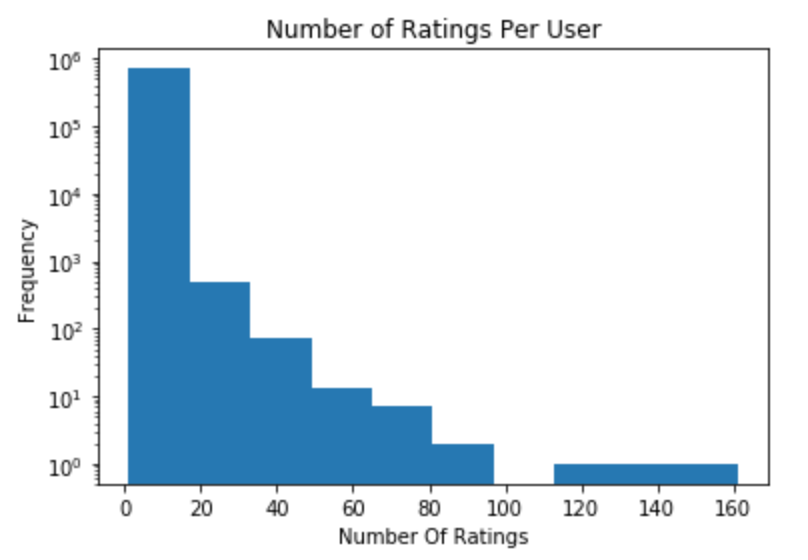
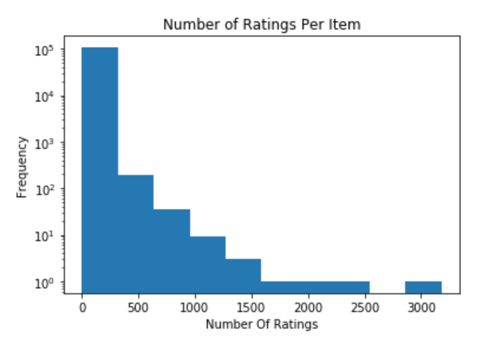
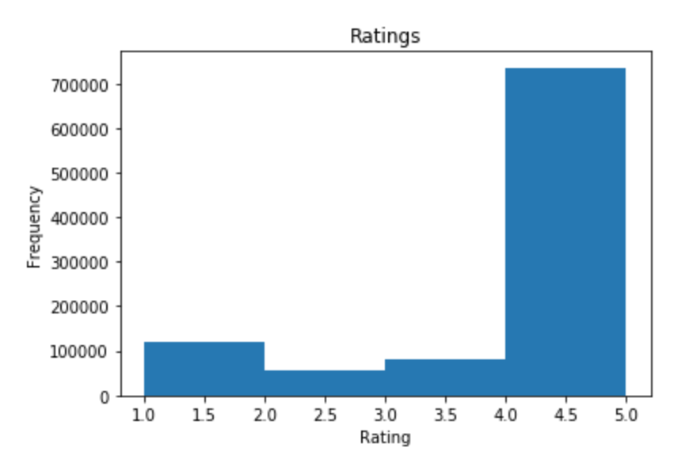

# l4l0b_a6

CPSC 340 a6 for l4l0b.

## 1.1
-----

[code](doc/a6.ipynb)  

### 1.1.1
Item: B000HCLLMM  
Link: https://www.amazon.com/dp/B000HCLLMM

### 1.1.2
Item: B000HCLLMM  
Link: https://www.amazon.com/dp/B000HCLLMM

### 1.1.3
Item: 0981850006  
Link: https://www.amazon.com/dp/0981850006

## 1.2
-----

### 1.2.1
  
[code](doc/a6.ipynb)  

### 1.2.2
  
[code](doc/a6.ipynb)  

### 1.2.3
  
[code](doc/a6.ipynb)  

## 1.3
-----
[code](doc/a6.ipynb)  
[103866 103865  98897  72226 102810]  
https://www.amazon.com/dp/B00IJB5MCS  
https://www.amazon.com/dp/B00IJB4MLA  
https://www.amazon.com/dp/B00EXE4O42  
https://www.amazon.com/dp/B00743MZCM  
https://www.amazon.com/dp/B00HVXQY9A  

## 1.4
-----
[code](doc/a6.ipynb)  
[103866 103867 103865  98068  98066]  
https://www.amazon.com/dp/B00IJB5MCS  
https://www.amazon.com/dp/B00IJB8F3G  
https://www.amazon.com/dp/B00IJB4MLA  
https://www.amazon.com/dp/B00EF45AHU  
https://www.amazon.com/dp/B00EF3YF0Y  

## 1.5
----
[code](doc/a6.ipynb)  
Grill brush total stars: 1244.0

Euclidean distance:  
103866: 266.0  
103865: 205.0  
98897: 5.0  
72226: 5.0  
102810: 5.0  

Cosine similarity:  
103866: 266.0  
103867: 438.0  
103865: 205.0  
98068: 311.0  
98066: 513.0  

In class we discussed how cosine similarity will find more popular items than euclidean distance.
This is shown by the results, the neighbours found while using cosine similarity have a much greater 
total popularity than those found while using euclidean distance.

## 1.6
----
[code](doc/a6.ipynb)  
[13756 58435 10620 27755 10980 ] 
https://www.amazon.com/dp/B000MVLB8W  
https://www.amazon.com/dp/B004W2GOZM  
https://www.amazon.com/dp/B000H1SJ8C  
https://www.amazon.com/dp/B001H1NG1Q  
https://www.amazon.com/dp/B000HCR8C4  

## 2
----
[code + report](doc/a6.ipynb)  

Final test error: 0.221

## 3
----
1. People tend to be excited about new things, so collaboartive filtering doesn't do a good job of predicting new    items
2. (10x20) + (20x20) + (20x5) = 700 weights. 20 + 20 + 5 = 45 biases. 700 + 45 = 745 parameters
3. If we do not user a non-linear activation function, then our output can be reproduced as a linear combination
	of the inputs, effectively causing our neural network to act as though it is one layer deep, regardless of its
	complexity
4. As depth increases, training error decreases and the model starts to overfit. Regularization can help to 
	minimize overfitting as depth increases
5. L2 regularization, early stopping, and dropout
6. Increasing the size of the filter would decrease the training error, but cause the model to overfit
7. In a convolutional neural network, each neuron isn't connected to every neuron in the previous layer like
	a fully-connected neural network. This means that a convolutional neural network has less parameters than a 
	fully-connected neural network

